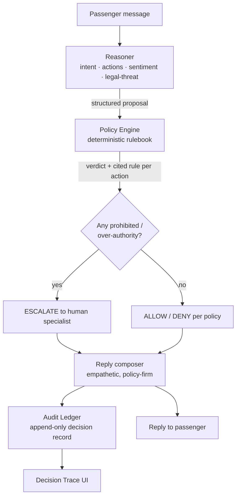

# Sky Lake — Architecture & Process Flow

**Assignment 3 · Customer-Facing Resolution Agent (Airline Disruption)**

---

## 1. Design principle

Sky Lake separates **language** from **judgment**:

- A **Reasoner** turns the passenger's words into a structured proposal (intent, requested
  actions, sentiment, legal-threat). It only *understands* — it never grants anything.
- A **deterministic Policy Engine** decides every entitlement and authority question from a
  rulebook encoded directly from the data pack, returning `ALLOW / DENY / ESCALATE` **with
  the exact rule cited**.

Because guarded actions only execute on an `ALLOW`, and prohibited requests resolve to
`ESCALATE`, the agent **cannot act beyond policy** regardless of what the language layer
proposes or how much the customer pushes.

## 2. Data-flow

## 3. Components

| Component | File | Responsibility |
|---|---|---|
| Reasoner | `src/lib/reasoner.ts` | Pattern-based NLU → `AgentProposal`. Behind a `Reasoner` interface so an LLM implementation is swappable. Keyless. |
| Policy Engine | `src/lib/core/policy-engine.ts` | Pure function: `AgentProposal → Decision`. Entitlements + `ALLOW/DENY/ESCALATE` per action, each with a cited rule. |
| Data pack | `src/lib/core/data.ts` | Customers, bookings, Service Rules, Allowed/Prohibited actions, ₹1,500 cap, exercise clock — encoded verbatim. |
| Reply composer | `src/lib/reply.ts` | Turns a `Decision` into an empathetic, policy-firm message. |
| Audit ledger | `src/lib/core/audit.ts` | Append-only per-turn record: message → sentiment → entitlements → verdicts → escalation. |
| API | `src/app/api/chat/route.ts` | Stateless: message + PNR → reasoner → engine → reply → ledger entry. |
| UI | `src/app/page.tsx` + `src/components/*` | Chat, scenario replay, passenger evidence card, live decision trace, resolution summary. |

## 4. Decision matrix (what the engine enforces)

| Request | Cancelled flight | Delayed flight | Notes |
|---|---|---|---|
| Rebook (free, ≤24h) | **ALLOW** | DENY | Free rebook is cancellation-only |
| Full refund (original method) | **ALLOW** | DENY | Refund within 7 business days |
| Cash refund to other method | **ESCALATE** | ESCALATE | Original method only — beyond authority |
| Meal voucher | — | **ALLOW** | Any delay |
| Lounge access | — | ALLOW if **>3h** | else DENY |
| Hotel (delayed hours) | — | ALLOW if **>5h** & not full-night | full-night → DENY |
| Voluntary higher-fare rebook | per fare diff | per fare diff | **> ₹1,500 → ESCALATE** (supervisor) |
| Free class upgrade | **DENY** | **DENY** | Comp beyond policy; tier = priority only |

**Global escalation trigger:** any mention of a **formal complaint / legal action** →
immediate `ESCALATE`, regardless of the other requests.

## 5. Process flow per turn

1. **Understand** — Reasoner extracts intent, requested actions, sentiment, legal-threat.
2. **Verify** — Engine looks up the booking, computes standard entitlements, and evaluates
   each requested action against the Service Rules + authority boundary.
3. **Resolve** — Verdicts (`ALLOW/DENY/ESCALATE`) are produced with cited rules; missing
   choices (e.g. rebook vs refund) become clarifying questions.
4. **Record** — The reply is composed and the full decision is appended to the audit ledger,
   rendered live in the Decision Trace panel.

## 6. Inputs, sources & assumptions

- **Sources:** the data pack only (profiles, bookings, Service Rules, Allowed/Prohibited).
- **Assumptions:** original payment method = card (cash-to-other-method → escalate); clock =
  Wed 23 Sep 2026; next-available inventory presented abstractly; sample conversations are
  tone-only.

## 7. Tech

Next.js 16 (App Router) · React 19 · TypeScript · shadcn/ui (Base UI + Tailwind v4) ·
Space Grotesk / Space Mono. Deterministic engine in plain TypeScript — no external calls,
no API key, one-command local run.
